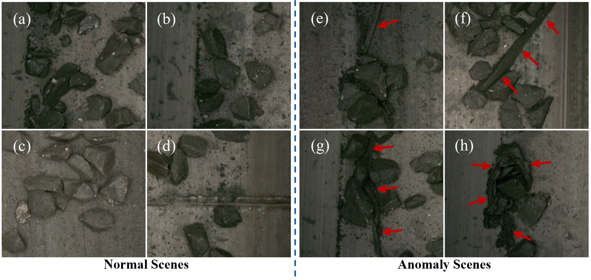
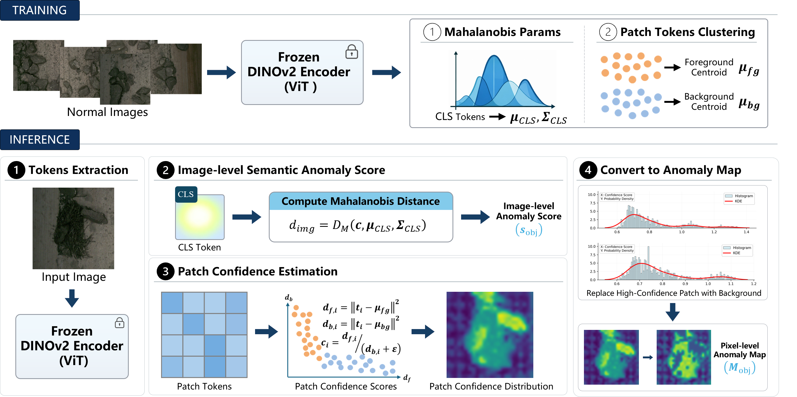
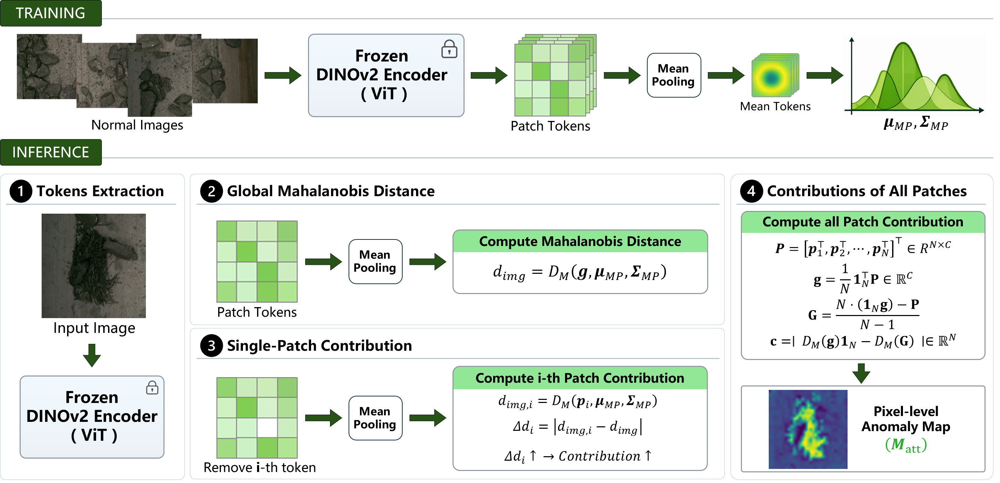
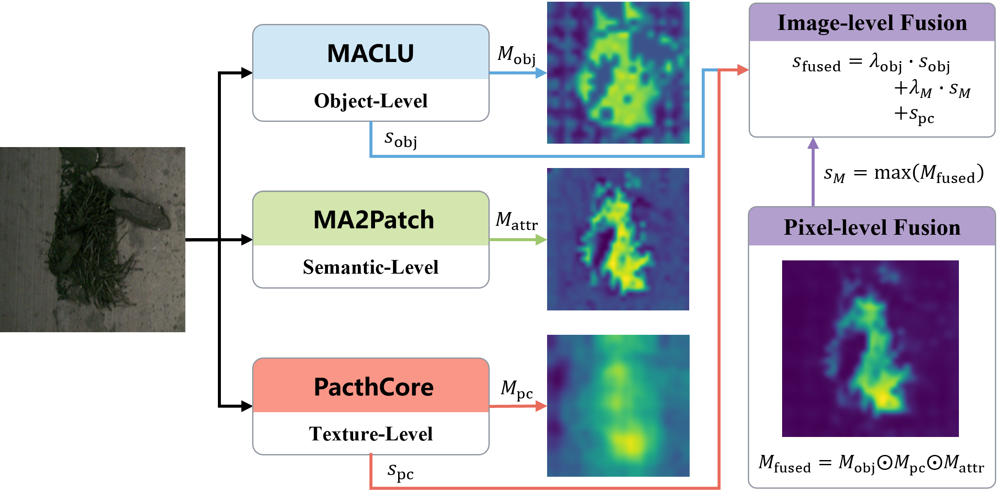

# USAD: Semantic-Deviation-Anchored Multi-Branch Fusion for Unsupervised Anomaly Detection and Localization in Unstructured Conveyor-Belt Coal Scenes

This repository provides the official implementation of our paper:

**Semantic-Deviation-Anchored Multi-Branch Fusion for Unsupervised Anomaly Detection and Localization in Unstructured Conveyor-Belt Coal Scenes**


## Abstract
Reliable foreign-object anomaly detection and pixel-level localization in conveyor-belt coal scenes are essential for safe and intelligent mining operations. This task is particularly challenging due to the highly unstructured environment: coal and gangue are randomly piled, backgrounds are complex and variable, and foreign objects often exhibit low contrast, deformation, and occlusion, resulting in strong coupling with their surroundings. These characteristics weaken the stability and regularity assumptions that many anomaly detection methods rely on in structured industrial settings, leading to notable performance degradation.

To support evaluation and comparison in this setting, we construct **CoalAD**, a benchmark for unsupervised foreign-object anomaly detection with pixel-level localization in coal-stream scenes. We further propose a **complementary-cue collaborative perception framework** that extracts and fuses complementary anomaly evidence from three perspectives: (1) object-level semantic composition modeling, (2) semantic-attribution-based global deviation analysis, and (3) fine-grained texture matching. The fused outputs provide robust image-level anomaly scoring and accurate pixel-level localization. Experiments on CoalAD demonstrate that our method outperforms widely used baselines across evaluated image-level and pixel-level metrics, and ablation studies validate the contribution of each component.

---

## CoalAD Dataset Examples



**Unstructured characteristics and low-contrast anomaly examples in conveyor-belt coal-stream scenes.**  
Normal samples are shown on the left (a–d) and anomalous samples on the right (e–h). Normal scenes exhibit randomly piled and intermixed coal and gangue with irregular sizes, shapes, and spatial distributions; meanwhile, belt wear patterns and coal dust introduce complex and variable backgrounds. In anomalous scenes, foreign objects (e.g., wood, nets/ropes, and bags) are often tightly coupled with the coal stream and thus difficult to distinguish due to low contrast, occlusion, and discoloration, which frequently results in blurred boundaries.

---

## Data Download

### Automatic Download (Recommended)
The dataset will be automatically downloaded and prepared during the first execution of the code.  
By default, it is downloaded from **ModelScope**: https://www.modelscope.cn/datasets/lyfjwp/CoalAD

### Manual Download (Alternative)
If automatic download fails, please download the dataset manually:

- **Baidu Netdisk**: https://pan.baidu.com/s/1DzBPM7fsVKdwUmz5_D3YUg?pwd=1234  
  (Extraction code: `1234`)

After downloading, please organize the dataset following the structure below:

```bash
root/
└── data/
    ├── coal_ad/
    │   ├── ground_truth/
    │   ├── test/
    │   └── train/
```
## Train Your Own Models

We provide training scripts for each branch:

- `train_ma_clu.py`: Train the **MACLU** branch  
- `train_ma2patch.py`: Train the **MA2Patch** branch  
- `train_pc.py`: Train the **PatchCore** branch  

Trained models will be saved to the `trained_models/` directory.

> **Note:** For three-branch fusion testing, please copy (or move) the trained models from `trained_models/` to `saved_models/`, overwriting the existing files if needed.

### Branch Pipelines

**MACLU** pipeline:  


**MA2Patch** pipeline:  


---

## Fusion Inference (Testing)

To run three-branch fusion testing, execute:

- `test_fusion.py`

This script loads model files from `saved_models/` and outputs the final detection and localization results.

### Fusion Pipeline



---

## Comparison with Representative Methods


---

## Acknowledgements

Part of our code is adapted from:  
https://github.com/LuigiFederico/PatchCore-for-Industrial-Anomaly-Detection

We sincerely thank the authors for their valuable contribution.

---

## Citation

If you find this work helpful, please consider citing our paper.
```bash
@misc{CoalAD,
      title={Semantic-Deviation-Anchored Multi-Branch Fusion for Unsupervised Anomaly Detection and Localization in Unstructured Conveyor-Belt Coal Scenes}, 
      author={Wenping Jin and Yuyang Tang and Li Zhu},
      year={2026},
      eprint={2602.07694},
      archivePrefix={arXiv},
      primaryClass={cs.CV},
      url={https://arxiv.org/abs/2602.07694}, 
}
```
